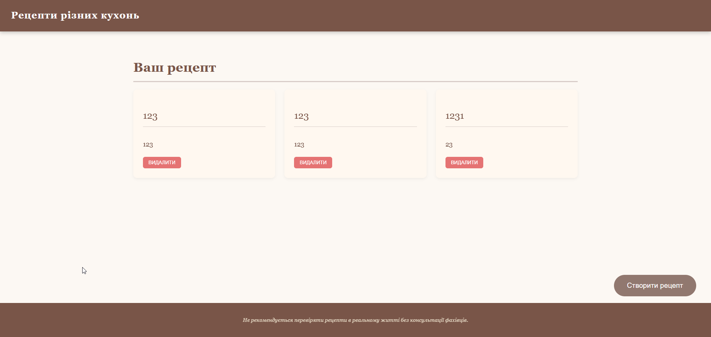

# 👋 Привет! Я — MiniAgusha

🎯 **Frontend разработчик**  
💻 Увлекаюсь созданием удобных и стильных веб-интерфейсов.  

---

## 🚀 Мои проекты

  

  

---

## 🛠️ Стек технологий

---

## ✨ Немного обо мне
- 🧠 Постоянно учусь новому  
- 🎨 Люблю продуманный дизайн и UX  
- 🧑‍💻 Работаю над pet-проектами и расширениями браузера  

---

📫 **Связаться со мной:**  

